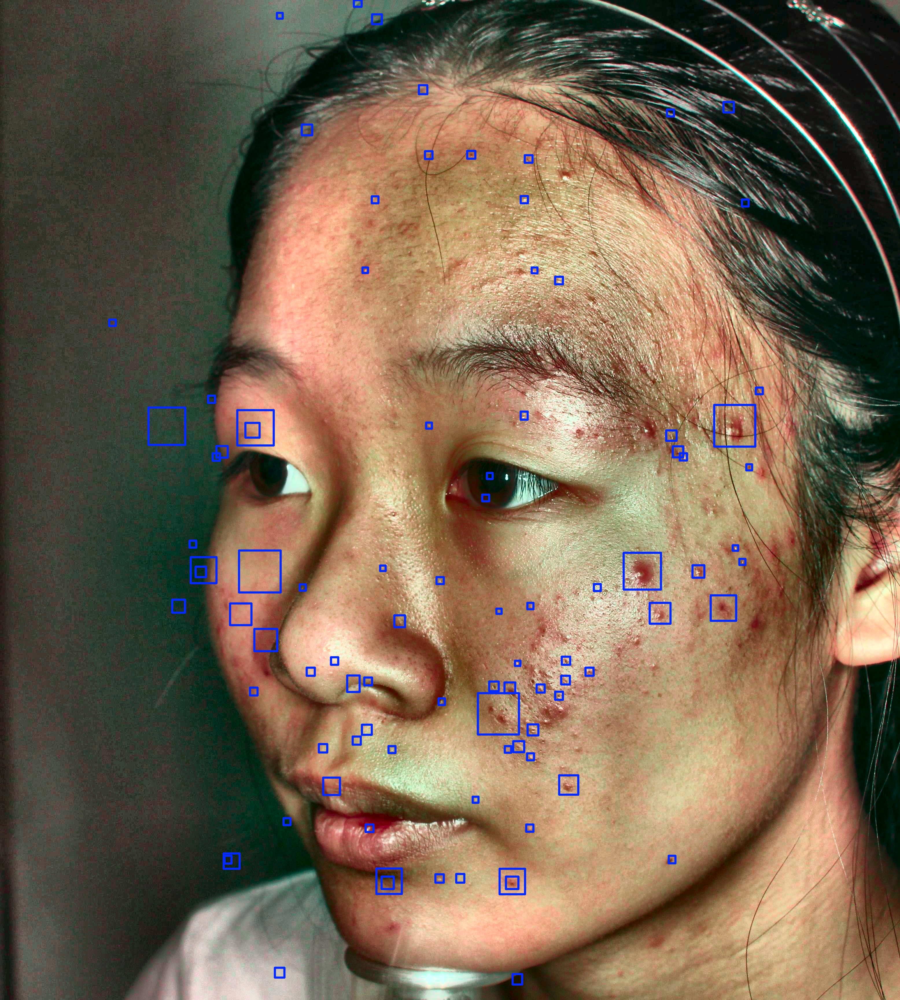
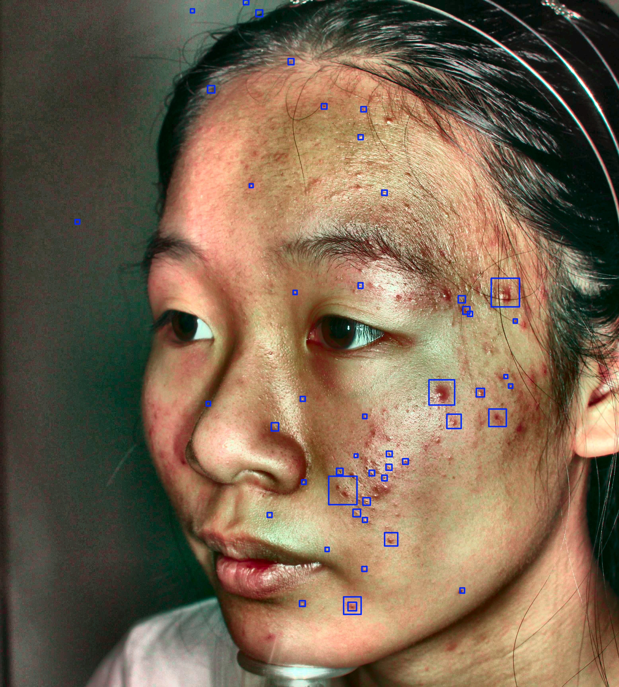

# Acne Detection Comparison

Generated:
2026-07-22 21:08

Comparison of YOLO inference configurations:

- Standard
- TTA (Test-Time Augmentation)
- SAHI (Sliced Inference)
- TTA + SAHI

---

# Images

## Standard

## TTA + SAHI

## TTA

## SAHI

---

# Metrics

| Config | Score | Time | Detections | Avg conf | Max conf | Min conf | Avg bbox |
|---|---:|---:|---:|---:|---:|---:|---:|
| Standard | 0.484 | 1.74s | 60 | 0.351 | 0.580 | 0.205 | 1999 |
| TTA + SAHI | 0.54 | 69.266s | 93 | 0.262 | 0.455 | 0.200 | 2524 |
| TTA | 0.511 | 5.088s | 74 | 0.356 | 0.584 | 0.205 | 2072 |
| SAHI | 0.454 | 29.085s | 48 | 0.263 | 0.455 | 0.204 | 2406 |

---

# Charts

## Number of detections

| Config | Detections |
|---|---:|
| Standard | 60 |
| TTA + SAHI | 93 |
| TTA | 74 |
| SAHI | 48 |

## Average confidence

| Config | Avg confidence |
|---|---:|
| Standard | 0.351 |
| TTA + SAHI | 0.262 |
| TTA | 0.356 |
| SAHI | 0.263 |

## Inference time

| Config | Time [s] |
|---|---:|
| Standard | 1.74 |
| TTA + SAHI | 69.266 |
| TTA | 5.088 |
| SAHI | 29.085 |

## Acne score

| Config | Score |
|---|---:|
| Standard | 0.484 |
| TTA + SAHI | 0.54 |
| TTA | 0.511 |
| SAHI | 0.454 |